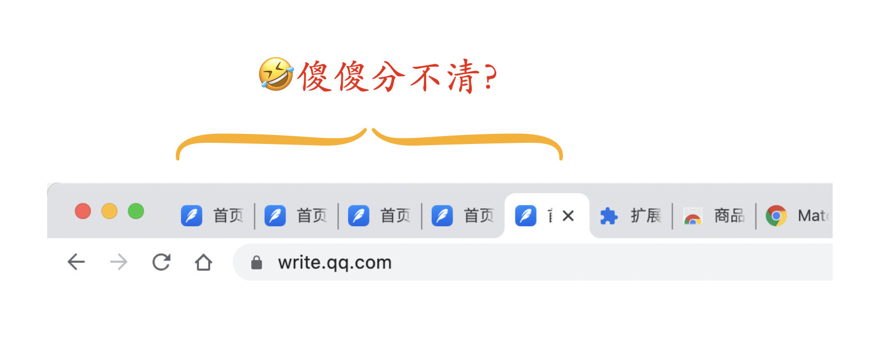
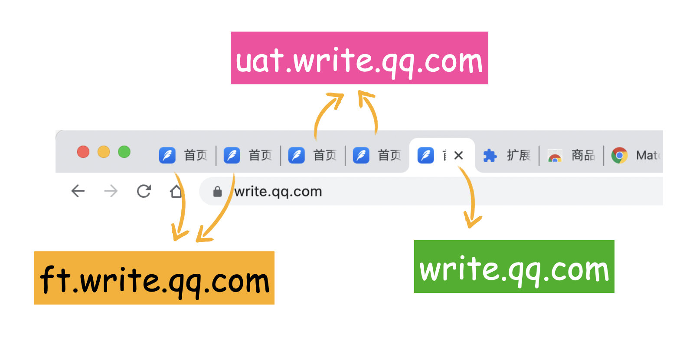
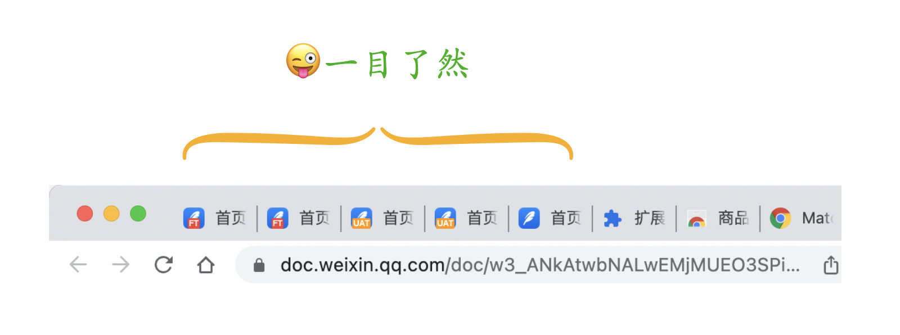
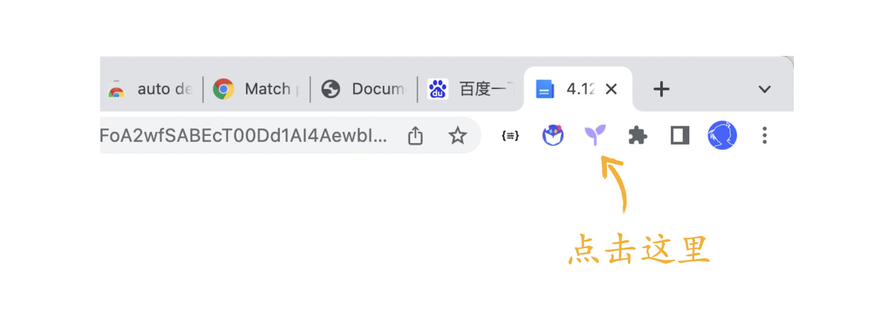
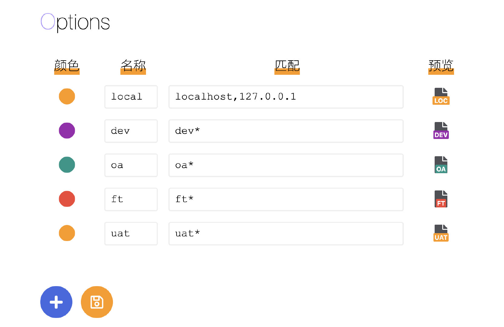

# environmental-favicon-chrome-plugin

不知道大家有没有碰到这样的问题：很多时候一个项目会存在多个环境，当浏览器标签页比较多的时候就完全分不清了

其实这里是有3个开发环境的

但是单独从 favicon 是没法快速区分哪个跟哪个的，为此，我做了一个 Chrome 插件可以很方便的解决这个问题，效果如下

是不是非常清晰呢？

## 使用

成功安装后，需要进入到**配置页**，也就是可以自定义匹配域名的页面，有 3 个入口

1. 直接点击右上角插件图标（推荐）

2. 右键右上角插件图标，点击“选项”

3. 进入插件详情页，点击“扩展程序选项”

下面就是一个简单的配置页面

这里简单说明一下

1. **颜色**是指小标签的背景色，这里预置了 8 种颜色可供选择
1. **名称**是指小标签的文本内容，由于宽度有限，最多支持两个中文字符或3个英文字符
1. **匹配**是指域名匹配，这里仅匹配 hostname，匹配规则是“模式匹配”，用英文逗号分隔可以填写多个，比如这里的`dev*`表示匹配所有以`dev`开头的域名，具体规则可参考 [URL_Pattern_API](https://developer.mozilla.org/en-US/docs/Web/API/URL_Pattern_API#examples)
1. 操作完成之后记得点击一下保存，会自动同步到 Chrome 账号
